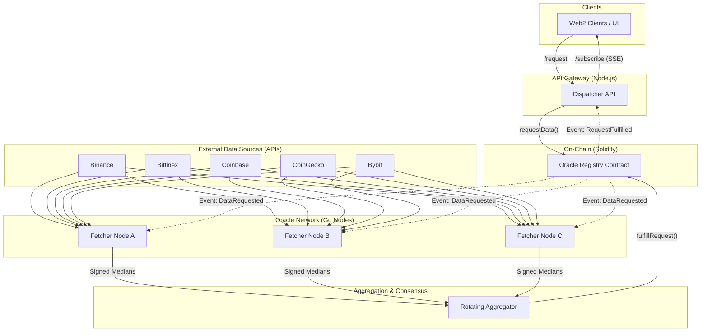

# Oracle: A Decentralized Price Feed Network

This project is a refactor of my original single-node oracle into a robust, multi-node Decentralized Oracle Network (DON). I've designed it to be resilient, transparent, and efficient, moving away from a centralized point of failure to a system where multiple independent Go nodes reach consensus on-chain.

## High-Level Architecture

The system is split into three main layers: the On-Chain settlement, the Off-Chain data ingestion, and the Aggregation layer that bridges them.



## Architectural Decisions & Tradeoffs

### 1. On-Chain Verification: Looping `ecrecover`
I decided to stick with a direct loop through `ecrecover` for multiple signatures.
- **Why:** It's the most straightforward way to verify ECDSA signatures in Solidity. Since I'm not building a massive production app with 1,000 nodes, the gas cost for a smaller set of nodes (5-10) is perfectly acceptable. Complexity was the main trade-off; I'd rather have code that is easy to audit than a complex Threshold Signature (TSS) implementation that might have hidden bugs.

### 2. Aggregator Rotation
To prevent any single node from being a bottleneck or a target for attacks, I've implemented a rotation mechanism.
- **Why:** If I only had one aggregator, the whole network stops if it goes offline. By rotating the responsibility based on the `requestId`, any registered node can step up to aggregate data and submit it to the contract.

### 3. Hybrid Data Ingestion (WebSocket + REST)
My fetcher nodes prioritize WebSocket streams for real-time prices but keep REST API endpoints as a fallback.
- **Why:** WebSockets are faster and reduce latency, but they can be flaky or hit rate limits if too many nodes connect. Having the REST fallback ensures I always get a price, even if the "live" stream drops.

### 4. Trusted Data Sources
I'm treating Binance, Bybit, Coinbase, etc., as the primary sources of truth. The nodes don't "validate" if Binance is right; they just report what it says.
- **Why:** I'm using high-repute exchanges. The "Decentralization" happens at my node level, ensuring that even if one of my nodes is compromised, the others will still report the correct data as seen from multiple APIs.

## Project Structure & Sub-Readmes

- [contracts/](file:///c:/PROJECTS/Oracle/contracts/README.md): Solidity registry, staking, and logic.
- [server/ingestion/](file:///c:/PROJECTS/Oracle/server/ingestion/README.md): Go Fetcher Node implementation.
- [server/aggregator/](file:///c:/PROJECTS/Oracle/server/aggregator/README.md): Go Aggregator and consensus logic.
- [server/dispatcher/](file:///c:/PROJECTS/Oracle/server/dispatcher/README.md): Node.js Client API Gateway for requests/events.
- [dashboard/](file:///c:/PROJECTS/Oracle/dashboard/README.md): Svelte UI for tracking price feeds and node health.

## Setup & Installation

I use `pnpm` for the frontend/contracts and standard Go tools for the backend.

### Prerequisites
- Go 1.21+
- Node.js & pnpm
- Docker & Docker Compose
- A local Ethereum node (Hardhat/Anvil) or a testnet provider (Alchemy/Infura)

### Quick Start

1. **Clone and Install Dependencies:**
   ```powershell
   git clone git@github.com:yourusername/Oracle.git
   cd Oracle
   pnpm install
   ```

2. **Setup Environment:**
   Copy `.env.example` to `.env` in the root and subdirectories, filling in your API keys and private keys.

3. **Deploy Contracts:**
   ```powershell
   cd contracts
   pnpm hardhat node
   # In another terminal
   pnpm hardhat run scripts/deploy.ts --network localhost
   ```

4. **Run the Network:**
   ```powershell
   docker-compose up --build
   ```

Check the individual folder READMEs for more detailed instructions on how to configure nodes and aggregators.
